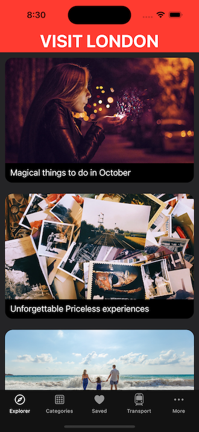
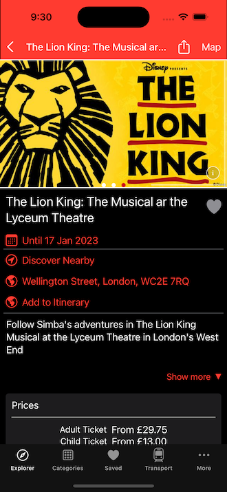
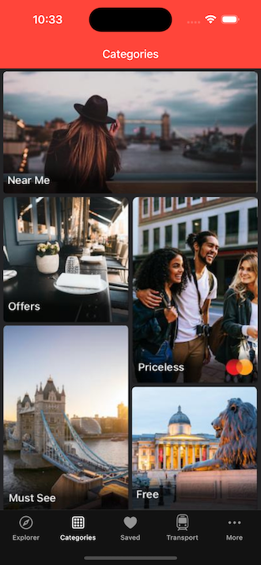
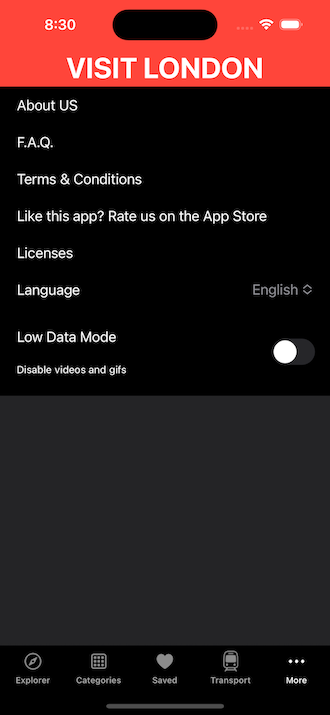
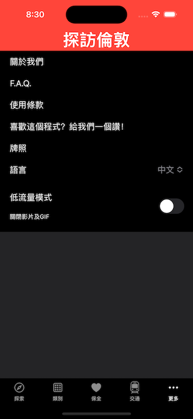

# TravelLondon

## Purpose: 

Mocking an app TravelLondon to practise SwiftUI

## Goal:

| Goal               | Status      | Skill
| ------------------ | ----------- |----------- |
| Explorer View | Done | SwiftUI
| Event Detail View | Done | Path   Transition   Intergrate with UIKit
| Map View | |
| Categories View | Done | SwiftUI
| Favourite View | WIP |
| Setting View | Done |
| Multi Language | Done | Userdefault

## Screenshot:

ExplorerView - 

EventDetailView -

CategoriesView - 

SettingView -

MultiLanguage -

